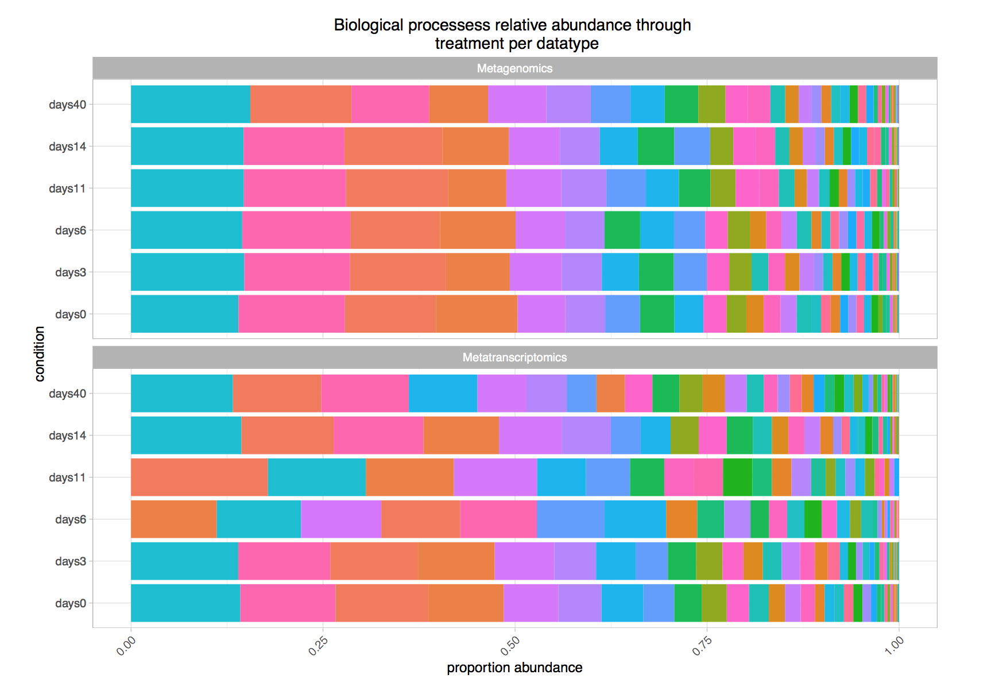
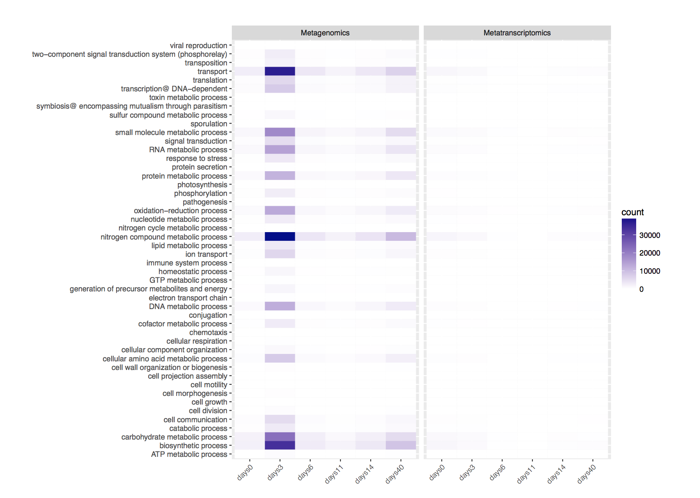
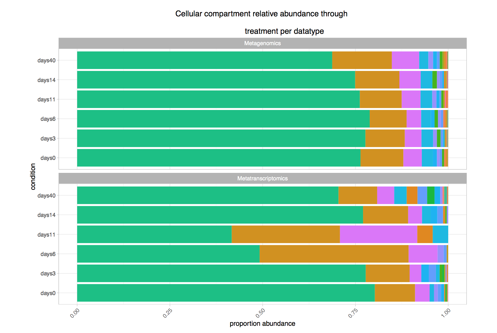
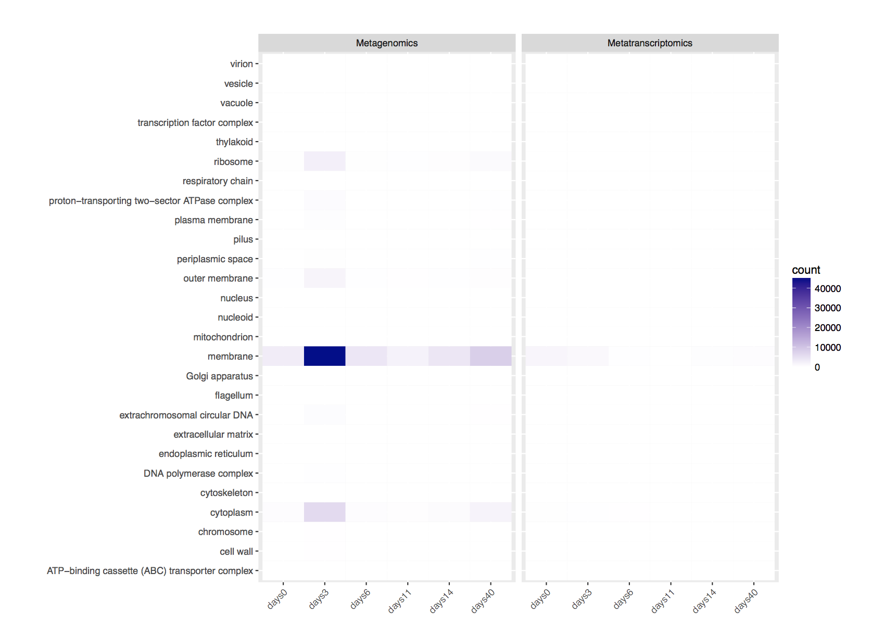

# Part 2: Functional analysis of EMG genomic and transcriptomic data using R
---
## Gut microbiota disturbance during antibiotic therapy: a multi-omic approach


##Introduction

Antibiotic usage strongly affects microbial intestinal metabolism and thereby impacts human health. Understanding this process and the underlying mechanisms remains a major research goal. Accordingly, we conducted the first comparative omic investigation of gut microbial communities in faecal samples taken at multiple time points from an individual subjected to Beta-lactam therapy.
_Perez-Cobas AE, et al. 2013 Gut 62(11), 1591-1601_


We will explore the data generated by the study above. The data is available at:
https://www.ebi.ac.uk/metagenomics/projects/ERP001506

```{r}
suppressWarnings(suppressMessages(require(stringr)))      # String format
suppressWarnings(suppressMessages(require(ade4)))         # Multivariate analysis
suppressWarnings(suppressMessages(require(ggplot2)))      # Fancy plotting
suppressWarnings(suppressMessages(require(grid)))         # Has the viewport function
suppressWarnings(suppressMessages(require(dplyr)))        # Data manipulation
suppressWarnings(suppressMessages(require(tidyr)))        # Data manipulation
suppressWarnings(suppressMessages(require(FactoMineR)))   # Multivariate analysis
suppressWarnings(suppressMessages(require(factoextra)))   # Visualize result of multivariate analysis
```

### Gather the necessary analysis results file from EMG portal

R provides a very versatile data structure that allows us to store various data types, namely the list.

```{r}
analysis_files <- c("BP_GO_abundances","BP_GO-slim_abundances","CC_GO_abundances","CC_GO-slim_abundances","GO_abundances","GO-slim_abundances","IPR_abundances","MF_GO_abundances","MF_GO-slim_abundances","phylum_taxonomy_abundances","taxonomy_abundances")
```

Read in all the contingency tables in the list making use of the lapply function

```{r}
baseanalysis = "https://www.ebi.ac.uk/metagenomics/projects/ERP001506/download/2.0/export?contentType=text&exportValue="
metadata <- "https://www.ebi.ac.uk/metagenomics/projects/ERP001506/overview/doExport";
filenames <- paste(baseanalysis, analysis_files, sep="")
results <- lapply(filenames,function(i){
print(i)
read.delim(i, header=TRUE)
})
metadata <- tbl_df(read.csv(file=metadata))

metadata <- metadata %>%
filter(Release.version>1) %>%
mutate(Sample.Name= gsub("Human gut metagenome, |Human gut metatranscriptome \\(mRNA\\), | after antibiotics","",Sample.Name)) %>%
mutate(Sample.Name= paste("days",gsub(" days", "", Sample.Name), sep="")) %>%
mutate(genomictype= ifelse(Experiment.type=="metatranscriptomic", "mRNA", "DNA")) %>%
rename(days=Sample.Name, id=Sample.ID, datatype=Experiment.type,genomictype=genomictype) %>%
select(days,id,datatype,genomictype) %>%
mutate(id=ifelse(datatype=="amplicon", paste(id, "_A", sep=""), ifelse(datatype=="metatranscriptomic", paste(id,"_T", sep=""), paste(id, "_G", sep="")))) %>%
mutate(datatype=str_to_title(datatype))
```

!!! note "Question"
How can we access elements in the list?

```{r}
attributes(results)
```
This approach enables us to assign a name to each entry in the list for unambiguous access to different contingency tables
```{r}
colheader <- gsub(analysis_files, pattern="-", replacement ="_")
names(results) <- colheader
attributes(results)
```
Let's have a look at results object

```{r}
str(results, list.len=4)
```

Each entry in the list can now be accessed by name. Give each row an explicit name before manipulating the table contents with dplyr functions. The main advantage of tbl_df (return a dataframe from a dataframe) is that it only displays a few rows and all the columns fit on the current screen, with the rest of the data displayed as text. We will be making extensive use of the dplyr package, which allows operations to be chained ("%>%"); it is analogous to the linux pipe command (|), see here for more details: https://cran.rstudio.com/web/packages/dplyr/vignettes/introduction.html  


### 1. Taxonomy: who is there and in what proportion?

We can optimise the display of the first few columns or so...

```{r}

taxonomy <- tbl_df(results$phylum_taxonomy_abundances)
taxonomy <- taxonomy %>% mutate(phylum=as.character(phylum))
tax_g <- taxonomy %>%
select(matches("_G|um")) %>%
mutate(DataType="Metagenomics")
tax_t <- taxonomy %>%
select(matches("_T|um")) %>%
mutate(DataType="Metatranscriptomics")
tax_a <- taxonomy %>%
select(matches("_A|um")) %>%
mutate(DataType="Amplicon")

renameSample <- function(metadata=metadata, localdf=localdf){
strippedcol <- colnames(localdf)
for (i in 1:nrow(metadata)){
strippedcol[which(strippedcol==as.character(metadata[i,2]))] <- as.character(metadata[i,1])
}
return(strippedcol)
}

colnames(tax_g) <- renameSample(metadata=metadata, localdf=tax_g)
colnames(tax_t) <- renameSample(metadata=metadata, localdf=tax_t)
colnames(tax_a) <- renameSample(metadata=metadata, localdf=tax_a)
```
Then transform a wide contingency table into a long one for the purposes of plotting.

```{r}
tax_metag <- tax_g %>% gather(condition, count, 3:ncol(tax_g)-1) %>%
group_by( condition) %>%
mutate(prop=count/sum(count))
tax_metat <- tax_t %>% gather(condition, count, 3:ncol(tax_t)-1) %>%
group_by( condition) %>%
mutate(prop=count/sum(count))
```
We can merge both metatranscriptomic and metagenomic relative occurrences of operational taxonomic units (OTU) per condition to visualise the community dynamic during treatment.

```{r}
genomic_transcriptomics <- rbind(tax_metag, tax_metat)
```
Bar plot of relative abundance of species
```{r}
genomic_transcriptomics %>% arrange(desc(prop)) %>%
ggplot( aes(x=condition, y=prop,fill=phylum)) +
geom_bar(stat='identity', position='fill', aes(fill = phylum)) +
facet_grid(~DataType) +
ggtitle('Species abundance through treatment per datatype') +
ylab('proportion abundance') +
theme_light() + theme(axis.text.x=element_text(angle=45, hjust=1)) +
coord_flip()
```


!!! note "Question"
    What conclusion would you draw from this distribution?

The heatmap is of absolute Species counts per datatypes

```{r}
genomic_transcriptomics %>%
ggplot( aes(x=condition,y=phylum))+ facet_grid(~DataType) +
geom_tile(aes(fill=count)) + scale_fill_gradient(low="white", high="darkblue") +
xlab("") + ylab("") + theme(axis.text.x=element_text(angle=45, hjust=1))
```


### 2. Function: who does what, in what relative proportion?

Recall the various functional annotations in the created list.

```{r}
attributes(results)
```

As an initial exploration, we will focus on a broad GO annotation (GO-slim)

** (A) GO Biological processes**: relative occurrence during treatment

```{r}
bp_slim <- tbl_df(results$BP_GO_slim_abundances)
bp_slim <- bp_slim %>% mutate(description=as.character(description))
bp_slim_g <- bp_slim %>%
select(matches("_G|description")) %>%
mutate(DataType="Metagenomics")
bp_slim_t <- bp_slim %>%
select(matches("_T|description")) %>%
mutate(DataType="Metatranscriptomics")
bp_slim_a <- bp_slim %>%
select(matches("_A|description")) %>%
mutate(DataType="Amplicon")
```

Give meaningful names to conditions, as for the taxonomic case above.

```{r}
colnames(bp_slim_g) <- renameSample(metadata=metadata, localdf=bp_slim_g)
colnames(bp_slim_t) <- renameSample(metadata=metadata, localdf=bp_slim_t)
colnames(bp_slim_a) <- renameSample(metadata=metadata, localdf=bp_slim_a)
bp_slim_metagenomics <- bp_slim_g %>%
gather(condition, count, 3:ncol(bp_slim_g)-1) %>%
group_by( condition) %>%
mutate(prop=count/sum(count))

bp_slim_metatransciptomics <- bp_slim_t %>%
gather(condition, count, 3:ncol(bp_slim_t)-1) %>%
group_by( condition) %>%
mutate(prop=count/sum(count))
```

Merge both metatranscriptomic and metagenomic relative occurences of biological process terms per condition to visualise the relative abundance of biological process terms that are dynamic during treatment.

```{r}
bp_genomic_transcriptomics <- rbind(bp_slim_metagenomics, bp_slim_metatransciptomics)
```
Bar plot of relative abundance of Biological Processes

```{r}
bp_genomic_transcriptomics %>% arrange(desc(prop)) %>%
ggplot( aes(x=condition, y=prop,fill=description)) +
geom_bar(stat='identity', position='fill', aes(fill = description)) +
facet_wrap(~DataType, ncol=1) +
ggtitle('Biological processess relative abundance through \n treatment per datatype') +
ylab('proportion abundance') +
theme_light() + theme(axis.text.x=element_text(angle=45, hjust=1)) + coord_flip() +
theme(legend.position="none")
```




!!! note "Question"
What can you conclude from this plot?

Heat map of absolute biological process counts per datatype

```{r}
bp_genomic_transcriptomics %>%
ggplot( aes(x=condition,y=description))+ facet_grid(~DataType) +
geom_tile(aes(fill=count)) + scale_fill_gradient(low="white", high="darkblue") +
xlab("") + ylab("") + theme(axis.text.x=element_text(angle=45, hjust=1))

```



Heat map of biological process proportions per datatype

```{r}
bp_genomic_transcriptomics %>%
ggplot( aes(x=condition,y=description))+ facet_grid(~DataType) +
geom_tile(aes(fill=prop)) + scale_fill_gradient(low="white", high="darkblue") +
xlab("") + ylab("") + theme(axis.text.x=element_text(angle=45, hjust=1))

```


**(B) GO Cellular Compartment**: relative occurence during treatment

```{r}
cc_slim <- tbl_df(results$CC_GO_slim_abundances)
cc_slim <- cc_slim %>% mutate(description=as.character(description))
cc_slim_g <- cc_slim %>%
select(matches("_G|description")) %>%
mutate(DataType="Metagenomics")
cc_slim_t <- cc_slim %>%
select(matches("_T|description")) %>%
mutate(DataType="Metatranscriptomics")
cc_slim_a <- cc_slim %>%
select(matches("_A|description")) %>%
mutate(DataType="Amplicon")
```
Give meaningful names to conditions as for the taxonomic case above

```{r}
colnames(cc_slim_g) <- renameSample(metadata=metadata, localdf=cc_slim_g)
colnames(cc_slim_t) <- renameSample(metadata=metadata, localdf=cc_slim_t)
colnames(cc_slim_a) <- renameSample(metadata=metadata, localdf=cc_slim_a)
```
Calculate the relative occurrence of cellular compartments per day of treatment for both metagenomic and transcriptomic data types.
```{r}
cc_slim_metagenomics <- cc_slim_g %>%
gather(condition, count, 3:ncol(cc_slim_g)-1) %>%
group_by( condition) %>%
mutate(prop=count/sum(count))

cc_slim_metatransciptomics <- cc_slim_t %>%
gather(condition, count, 3:ncol(cc_slim_t)-1) %>%
group_by( condition) %>%
mutate(prop=count/sum(count))
```
Merge both metatranscriptomic and metagenomic relative occurrences of biological processes per condition to visualise the relative abundance of biological process terms that are dynamic during treatment.

```{r}
cc_genomic_transcriptomics <- rbind(cc_slim_metagenomics, cc_slim_metatransciptomics)
```

Bar plot of relative abundances of cellular compartment

```{r}
cc_genomic_transcriptomics %>% arrange(desc(prop)) %>%
ggplot( aes(x=condition, y=prop,fill=description)) +
geom_bar(stat='identity', position='fill', aes(fill = description)) +
facet_wrap(~DataType, ncol=1) +
ggtitle('Cellular compartment relative abundance through \n
treatment per datatype') +
ylab('proportion abundance') + theme_light() +
theme(axis.text.x=element_text(angle=45, hjust=1)) +
coord_flip() + theme(legend.position="none")
```



!!! note "Question"
    What can you conclude from this plot?

Heat map of absolute cellular compartment term counts per datatype

```{r}
cc_genomic_transcriptomics %>%
ggplot( aes(x=condition,y=description))+ facet_grid(~DataType) +
geom_tile(aes(fill=count)) + scale_fill_gradient(low="white", high="darkblue") +
xlab("") + ylab("") + theme(axis.text.x=element_text(angle=45, hjust=1))
```



Heat map of Cellular compartment term proportions per datatype

```{r}
cc_genomic_transcriptomics %>%
ggplot( aes(x=condition,y=description))+ facet_grid(~DataType) +
geom_tile(aes(fill=prop)) + scale_fill_gradient(low="white", high="darkblue") +
xlab("") + ylab("") + theme(axis.text.x=element_text(angle=45, hjust=1))

```


**(C) GO Molecular function**: relative occurence during treatment

Extract the data from the data structure "results" created earlier.

```{r}
mf_slim <- tbl_df(results$MF_GO_slim_abundances)
mf_slim <- mf_slim %>% mutate(description=as.character(description))
mf_slim_g <- mf_slim %>% 
			select(matches("_G|description")) %>% 
            mutate(DataType="Metagenomics")
mf_slim_t <- mf_slim %>% 
            select(matches("_T|description")) %>% 
            mutate(DataType="Metatranscriptomics") 
mf_slim_a <- mf_slim %>% 
            select(matches("_A|description"))  %>% 
            mutate(DataType="Amplicon")
```  

Give meaningful names to conditions as for the taxonomic case above

```{r}
colnames(mf_slim_g) <- renameSample(metadata=metadata, localdf=mf_slim_g)
colnames(mf_slim_t) <- renameSample(metadata=metadata, localdf=mf_slim_t)
colnames(mf_slim_a) <- renameSample(metadata=metadata, localdf=mf_slim_a)

mf_slim_metagenomics <- mf_slim_g %>% 
                        gather(condition, count, 3:ncol(mf_slim_g)-1) %>%
                        group_by( condition) %>% 
                        mutate(prop=count/sum(count))

mf_slim_metatransciptomics <- mf_slim_t %>% 
                              gather(condition, count, 3:ncol(mf_slim_t)-1) %>%
                              group_by( condition) %>%
                              mutate(prop=count/sum(count))
```

Merge both metatranscriptomic and metagenomic relative occurrences of biological processes per condition to visualise the relative abundances of biological process terms that are dynamic during treatment.  

```{r}
mf_genomic_transcriptomics <- rbind(mf_slim_metagenomics, mf_slim_metatransciptomics)

```

Barplot of relative abundance Molecular function

```{r}
mf_genomic_transcriptomics %>% arrange(desc(prop)) %>%
ggplot( aes(x=condition, y=prop,fill=description)) +
geom_bar(stat='identity', position='fill', aes(fill = description)) +
facet_wrap(~DataType, ncol=1) +
ggtitle('Molecular function relative abundance through
\n treatment per datatype') +
ylab('proportion abundance') +
theme_light() +
theme(axis.text.x=element_text(angle=45, hjust=1)) +
coord_flip() +
theme(legend.position="none")# + guides(fill=guide_legend(ncol=2))
```
Heatmap of Absolute Molecular Function term counts through treatment

```{r}
mf_genomic_transcriptomics %>%
ggplot( aes(x=condition,y=description)) + facet_grid(~DataType) +
geom_tile(aes(fill=count)) + scale_fill_gradient(low="white", high="darkblue") +
xlab("") + ylab("") + theme(axis.text.x=element_text(angle=45, hjust=1))

```
Heat map of relative occurrence of molecular function term counts throughout treatment

```{r}
mf_genomic_transcriptomics %>%
ggplot( aes(x=condition,y=description))+
geom_tile(aes(fill=prop)) + facet_grid(~DataType) +
scale_fill_gradient(low="white", high="darkblue") +
xlab("") + ylab("") + theme(axis.text.x=element_text(angle=45, hjust=1))

```
!!! note "Question"
    What can you conclude from the plots?


